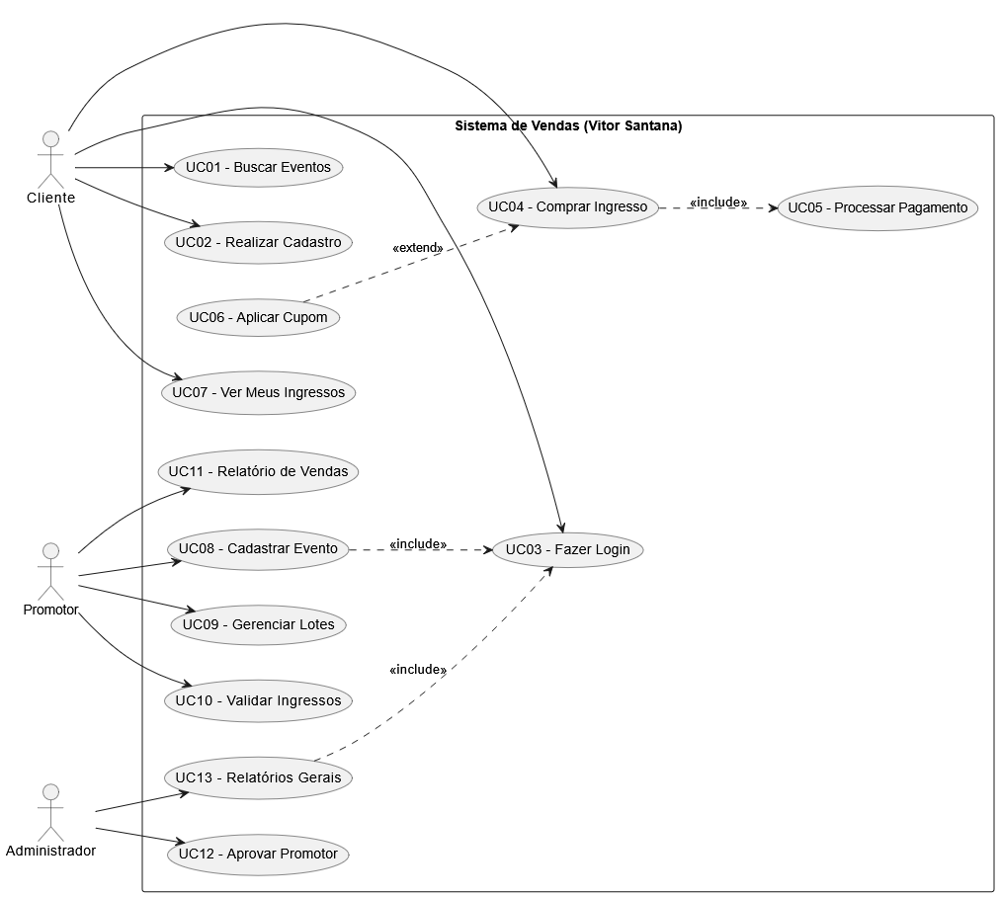
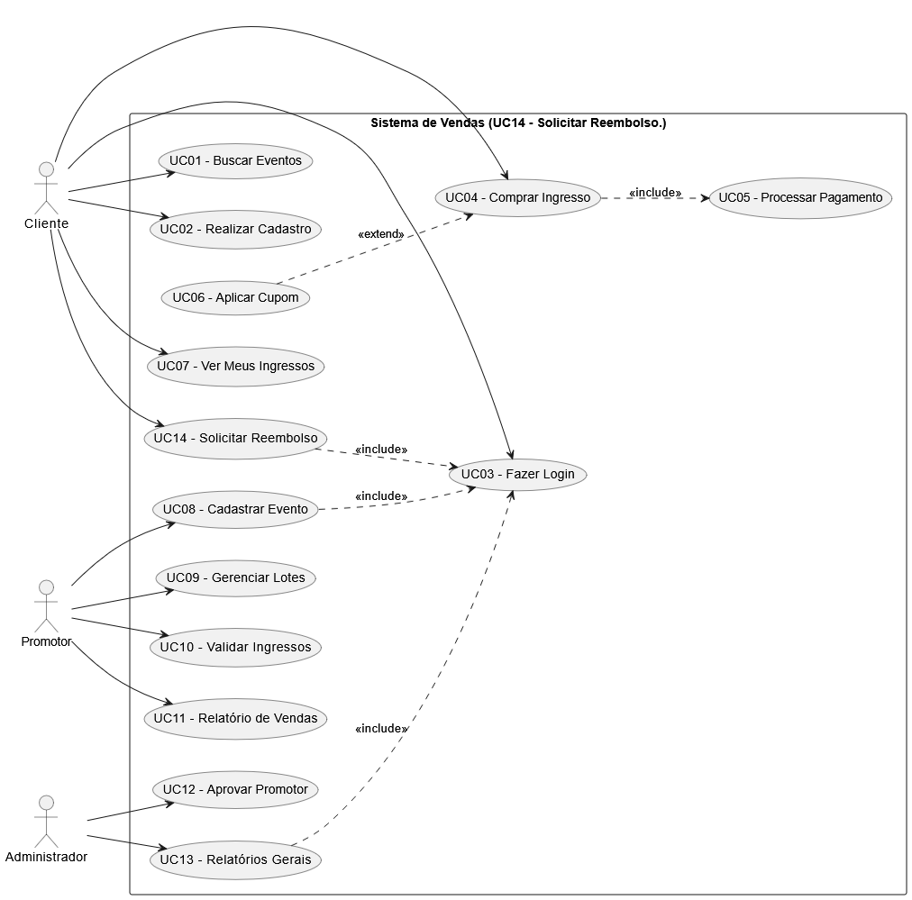
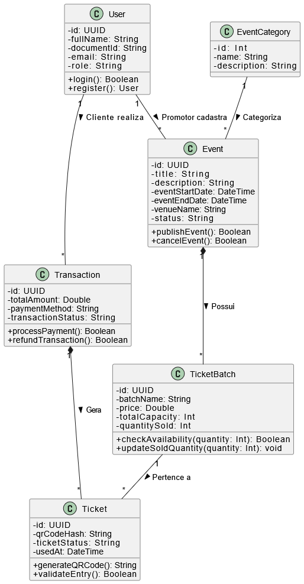
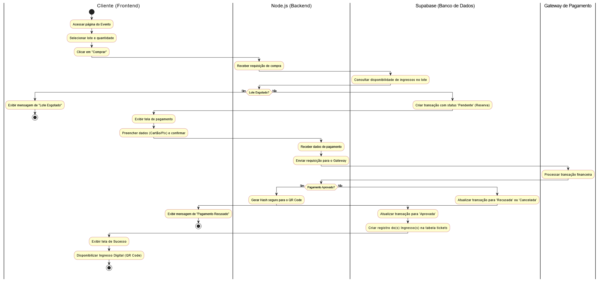

# 🎟️ Sistema de Venda de Ingressos (VSSTickets)

Projeto de Engenharia de Software desenvolvido para o Centro Universitário UniRuy Wyden, contemplando o ciclo completo de desenvolvimento: desde o levantamento de requisitos até a implementação e deploy em nuvem.

**Disciplina:** Engenharia de Software (2026.1)  
**Professor:** Msc. Heleno Cardoso  
**Equipe:**
- Vítor Silva Santana

---

## 🚀 Tecnologias Utilizadas
* **Backend:** Node.js
* **Banco de Dados / BaaS:** Supabase (PostgreSQL)
* **Frontend:** React.js 
* **Modelagem:** Draw.io

---

## 1. Introdução e Objetivos
Este projeto consiste em uma plataforma completa para a gestão e venda de ingressos (focada em eventos, abadás e camarotes). O sistema permite que promotores de eventos publiquem seus catálogos, acompanhem as vendas em tempo real e realizem a validação de entrada via QR Code. Para o cliente final, a plataforma oferece um ambiente seguro para compra digital com emissão instantânea de ingressos.

---

## 2. Funcionalidades e Requisitos

### Atores do Sistema
1. **Cliente:** Usuário final que navega pelo catálogo, realiza compras e acessa ingressos.
2. **Promotor:** Organizador que cadastra eventos, gerencia lotes e valida a entrada.
3. **Administrador:** Gestor global da plataforma.

### Requisitos Funcionais (RF)
* **[RF01]** O sistema deve permitir que o Cliente realize cadastro, login e visualize o catálogo de eventos.
* **[RF02]** O sistema deve permitir que o Cliente compre ingressos e acesse seu ticket digital (QR Code).
* **[RF03]** O sistema deve permitir que o Promotor cadastre, edite e gerencie eventos e lotes de ingressos (capacidade/preço).
* **[RF04]** O sistema deve fornecer ao Promotor a funcionalidade de validação de QR Code na portaria do evento.
* **[RF05]** O sistema deve permitir a solicitação de reembolso por parte do Cliente logado.

### Requisitos Não Funcionais (RNF)
* **[RNF01] Segurança:** Controle de acesso rígido utilizando *Row Level Security (RLS)* do Supabase.
* **[RNF02] Disponibilidade:** A aplicação deve ser hospedada em ambiente CLOUD com alta disponibilidade.
* **[RNF03] Concorrência:** O banco de dados deve tratar acessos simultâneos para evitar venda em duplicidade de ingressos de um mesmo lote.

---

## 3. Modelagem do Banco de Dados (Dicionário de Dados)
O banco de dados relacional foi estruturado no Supabase (PostgreSQL). Abaixo estão as tabelas principais:

* **`users`**: Gerencia dados de autenticação e perfis de acesso (`cliente`, `promotor`, `admin`).
* **`event_categories`**: Categorização para facilitar a busca de eventos.
* **`events`**: Informações do evento (título, datas, local), associado a um `promotor`.
* **`ticket_batches`**: Controle de lotes, definindo preço e `total_capacity` para evitar superlotação.
* **`transactions`**: Controle financeiro do carrinho de compras e status de pagamento.
* **`tickets`**: Ingresso físico/digital individual gerado após a compra aprovada, contendo um `qr_code_hash` único para validação na catraca.

*(Acesse a pasta `/database` neste repositório para visualizar o script SQL completo).*

---

## 4. Diagramas UML

### 4.1. Diagrama de Casos de Uso
Demonstra a interação dos três atores principais com as funcionalidades do sistema, incluindo fluxos de exceção e obrigatoriedades (`<<include>>` e `<<extend>>`).

### 4.2. Diagrama de Classes
Estrutura orientada a objetos mapeando as entidades do domínio, seus atributos privados, métodos públicos (ações da API em Node.js) e regras de multiplicidade.

### 4.3. Diagrama de Atividades (Fluxo de Compra)
Detalha o fluxo transacional do checkout de ingressos, evidenciando as raias de execução entre Frontend, Backend (Node.js), Banco de Dados (Supabase) e Gateway de Pagamento, incluindo a trava de concorrência por lotes esgotados.

## 5. Processo de Implantação (Deploy)
* **Banco de Dados:** Instância gerenciada pelo Supabase Cloud.
* **Backend (API):** Hospedado em [Nome do Serviço Cloud, ex: Render / Railway].
* **Frontend:** Hospedado em [Nome do Serviço Cloud, ex: Vercel].

O processo de homologação ocorre via chamadas de teste nas rotas da API, garantindo que o tempo de resposta e as restrições de RLS estejam funcionando conforme os RNFs estipulados no projeto.
